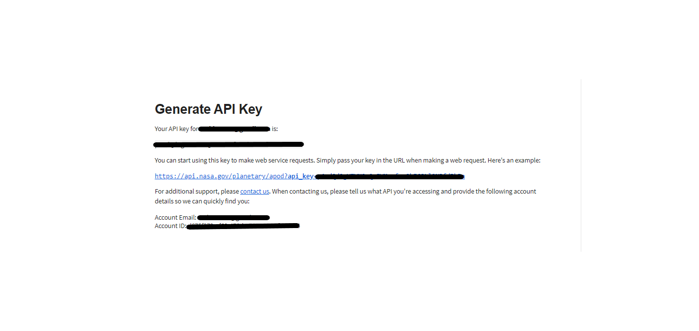
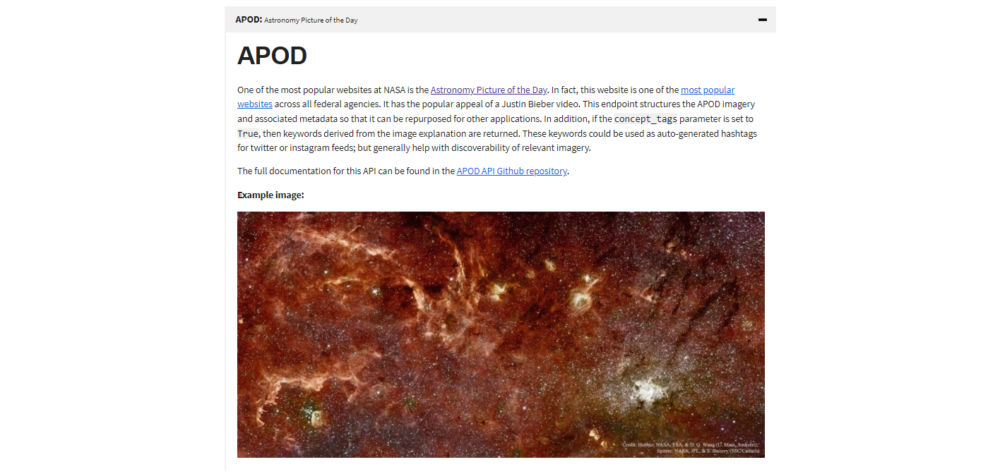

# NASA_APOD

Visit to = https://api.nasa.gov/
to generate api key you need to register

After regestration you get generated API Key like

HTTP Request
GET https://api.nasa.gov/planetary/apod

Query Parameters

Example query
https://api.nasa.gov/planetary/apod?api_key=DEMO_KEY
